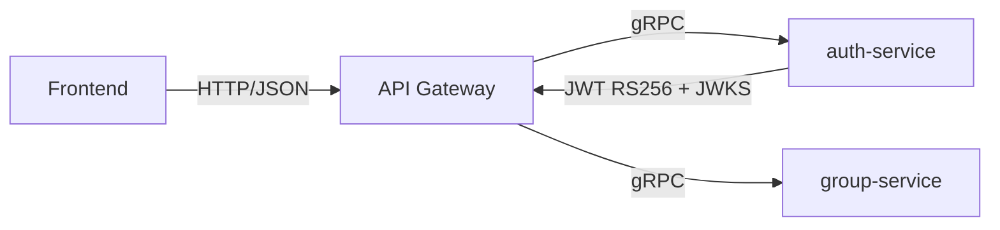

# Kiến Thức Microservice Cho MoneyTracking

Tài liệu này được viết theo hướng dễ hiểu, dùng chính project `MoneyTracking` làm ví dụ. Mục tiêu là giúp bạn hiểu kiến trúc microservice bằng ngôn ngữ gần gũi, không chỉ biết “nó chạy như thế nào” mà còn hiểu “vì sao lại làm như vậy”.

## 1. Nhìn tổng quan trước

Nếu tóm tắt cực ngắn, kiến trúc backend hiện tại của `MoneyTracking` là:

```text
Frontend -> HTTP -> api-gateway -> gRPC -> auth-service / group-service
```

Ý nghĩa:

- `Frontend` chỉ nói chuyện với `api-gateway`
- `api-gateway` là cổng vào public của backend
- `auth-service` lo xác thực, token, menu, CSRF
- `group-service` lo nghiệp vụ liên quan tới group
- giữa các service nội bộ, project đang dùng `gRPC`

Nếu bạn nhớ được một ý duy nhất, hãy nhớ ý này:

- `Frontend` nói chuyện với `gateway`
- `gateway` nói chuyện với các service nội bộ

## 2. Microservice là gì

`Microservice` là cách chia backend thành nhiều service nhỏ, mỗi service phụ trách một nhóm trách nhiệm riêng.

Ví dụ trong `MoneyTracking`:

- `auth-service` lo xác thực và token
- `group-service` lo dữ liệu và logic của group
- `api-gateway` lo nhận request từ bên ngoài và điều phối request vào service phù hợp

Ý tưởng của microservice là:

- chia nhỏ trách nhiệm
- tách code theo nghiệp vụ
- dễ scale từng phần
- dễ phát triển nhiều service song song hơn

## 3. Monolith và Microservice khác nhau thế nào

### Monolith

`Monolith` là kiểu:

- tất cả logic backend nằm trong một ứng dụng lớn
- cùng một process
- cùng một nơi build và deploy

Ví dụ:

- login, group, menu, admin, user, notification cùng nằm trong một app backend duy nhất

Ưu điểm:

- đơn giản
- dễ debug lúc đầu
- dễ deploy khi project còn nhỏ

Nhược điểm:

- lớn dần lên sẽ khó tách trách nhiệm
- deploy một phần cũng phải deploy cả app
- scale riêng một nghiệp vụ khó hơn

### Microservice

`Microservice` là kiểu:

- chia backend thành nhiều service nhỏ
- mỗi service có vai trò rõ ràng
- các service gọi nhau qua network

Ưu điểm:

- tách nghiệp vụ rõ
- scale riêng từng service được
- dễ thay đổi từng phần

Nhược điểm:

- phức tạp hơn monolith
- thêm chi phí về network, auth, monitoring, tracing, deploy
- nếu chia quá sớm thì có thể tự làm khó mình

## 4. Khi nào nên dùng microservice, khi nào chưa cần

Nên cân nhắc microservice khi:

- nghiệp vụ đã tách rõ thành nhiều miền
- team bắt đầu lớn hơn
- cần scale từng phần khác nhau
- một app lớn đã bắt đầu khó bảo trì

Chưa cần microservice khi:

- app còn nhỏ
- team ít người
- nghiệp vụ chưa rõ
- bạn còn đang lo làm cho chạy được trước

Hiểu thực tế:

- microservice không tự động làm hệ thống tốt hơn
- nó chỉ tốt hơn nếu độ phức tạp nghiệp vụ đủ lớn để xứng đáng

## 5. Vai trò của từng thành phần trong một hệ microservice cơ bản

### Frontend

`Frontend` là nơi người dùng thao tác:

- web app
- mobile app

Frontend thường:

- gửi request HTTP
- nhận JSON
- hiển thị dữ liệu

### API Gateway

`API Gateway` là cổng vào chung của backend.

Vai trò chính:

- nhận request từ frontend
- route request tới đúng service
- gom auth, csrf, cookie, error handling, logging theo một nơi

Trong `MoneyTracking`, đây là `api-gateway`.

### Auth Service

`Auth Service` lo các phần như:

- login
- logout
- refresh token
- phát hành token
- verify token
- menu hoặc thông tin auth liên quan

Trong `MoneyTracking`, đây là `auth-service`.

### Business Service

Đây là các service lo nghiệp vụ riêng.

Ví dụ trong `MoneyTracking`:

- `group-service` lo group, thành viên group, lời mời

### Database, cache, message queue

Một hệ microservice thường còn có:

- `database` để lưu dữ liệu
- `cache` như Redis
- `message queue` như RabbitMQ

Không phải lúc nào microservice cũng cần đủ cả 3, nhưng khi hệ thống lớn lên thì đây là các thành phần rất thường gặp.

## 6. Vì sao frontend thường gọi HTTP tới gateway

Frontend thường gọi `HTTP` tới `gateway` vì:

- frontend chạy trong browser hoặc app mobile
- HTTP là giao thức tự nhiên nhất ở lớp này
- thư viện, devtool, browser support đều tốt

Ngoài ra, để frontend gọi vào một `gateway` còn có lợi vì:

- frontend chỉ cần biết một địa chỉ backend
- không cần biết hệ thống có bao nhiêu microservice bên trong
- không cần tự xử lý topology backend

Hiểu đơn giản:

- frontend càng ít phải biết chuyện nội bộ backend thì càng tốt

## 7. Vì sao frontend không nên gọi thẳng từng microservice

Nếu frontend gọi thẳng từng microservice, sẽ có các vấn đề:

- frontend phải biết từng service nằm ở đâu
- frontend phải tự xử lý auth cho từng service
- frontend phải chịu thay đổi nếu backend đổi topology
- CORS, cookie, csrf, error format có thể bị phân tán

Ví dụ:

- hôm nay FE gọi `auth-service` và `group-service`
- ngày mai backend tách thêm `expense-service`
- FE lại phải sửa nhiều nơi để biết service mới

Nếu có gateway:

- FE vẫn chỉ gọi một nơi
- backend tự thay đổi nội bộ mà ít ảnh hưởng FE hơn

## 8. Vì sao gateway gọi gRPC vào service nội bộ

Trong nhiều hệ thống, `gateway` hoặc service nội bộ dùng `gRPC` để gọi nhau vì:

- contract rõ bằng protobuf
- payload dạng nhị phân, thường nhẹ hơn JSON
- code client/server sinh ra sẵn, bớt sai tay
- tối ưu tốt cho giao tiếp service-to-service

Trong `MoneyTracking`, `api-gateway` đang gọi:

- `auth-service` qua gRPC
- `group-service` qua gRPC

Điều này phù hợp với mô hình:

- ngoài hệ thống dùng HTTP
- bên trong hệ thống dùng gRPC

## 9. HTTP JSON và gRPC khác nhau thế nào

### HTTP JSON

Ưu điểm:

- dễ nhìn
- dễ test bằng Postman/cURL/devtools
- rất hợp cho frontend/public API

Nhược điểm:

- payload thường nặng hơn
- parse/serialize JSON tốn hơn so với binary trong nhiều trường hợp
- contract thường lỏng hơn nếu bạn không quản rất kỹ

### gRPC

Ưu điểm:

- payload nhị phân
- contract rõ bằng `.proto`
- codegen client/server tốt
- hợp cho service nội bộ

Nhược điểm:

- khó nhìn trực tiếp hơn JSON
- không tự nhiên bằng HTTP JSON cho browser/public client
- debug thủ công với người mới có thể khó hơn

## 10. Vì sao gRPC thường nhanh hơn

Nói cẩn thận:

- không được khẳng định `gRPC luôn nhanh hơn mọi nơi`
- nhưng trong giao tiếp nội bộ service-to-service, `gRPC` thường có lợi về hiệu năng

Những lý do thường gặp:

- payload nhị phân nhỏ hơn JSON
- protobuf giúp serialize/deserialize hiệu quả hơn
- contract rõ nên runtime ít mơ hồ hơn
- stack gRPC được tối ưu cho RPC nội bộ

Ví dụ dễ hiểu:

- cùng một dữ liệu
- JSON thường verbose hơn
- protobuf thường gọn hơn
- khi số request tăng nhiều, phần chênh lệch đó bắt đầu đáng kể

Nhưng cũng cần nhớ:

- nếu request rất đơn giản, dữ liệu rất ít, hệ thống nhỏ thì chênh lệch có thể không quá lớn
- chọn gRPC không phải chỉ vì “nhanh hơn”, mà còn vì contract service nội bộ rõ và sạch hơn

## 11. Luồng request mẫu trong MoneyTracking

Luồng dễ hình dung:

```text
Frontend
  -> HTTP request
api-gateway
  -> gRPC Verify/Login/Group call
auth-service hoặc group-service
  -> trả response cho gateway
gateway
  -> trả HTTP response cho frontend
```

Ví dụ:

1. FE gửi `POST /api/auth/login` tới `api-gateway`
2. `api-gateway` gọi gRPC sang `auth-service`
3. `auth-service` xử lý login, tạo token
4. kết quả trả lại cho `api-gateway`
5. gateway set cookie hoặc trả JSON cho FE

## 12. Vì sao cách đó giúp frontend đơn giản hơn

Frontend chỉ cần biết:

- một host backend
- một bộ route công khai

Frontend không cần biết:

- `auth-service` ở port nào
- `group-service` ở đâu
- service nào gọi service nào

Ngoài ra, gateway có thể gom:

- auth middleware
- cookie handling
- csrf handling
- chuẩn hóa error response
- route aggregation

Hiểu dễ nhớ:

- `gateway` giúp FE nhìn backend như một hệ thống duy nhất
- dù bên trong thực ra có nhiều service

## 13. Token trong microservice: 1 key và 2 key

### Dùng 1 key

Đây là kiểu `shared secret`, thường gặp với:

- `HS256`

Ý nghĩa:

- cùng một secret dùng để ký token
- và cũng chính secret đó dùng để verify token

Ưu điểm:

- đơn giản
- dễ làm

Nhược điểm:

- ai verify được thì cũng có thể tự ký token nếu biết secret

### Dùng 2 key

Đây là kiểu `asymmetric`, thường gặp với:

- `RS256`

Ý nghĩa:

- `private key` để ký token
- `public key` để verify token

Ưu điểm:

- nơi verify token không cần giữ private key
- chỉ nơi phát hành token mới có quyền ký

Đây là điểm rất hợp với microservice.

## 14. Vì sao microservice thường hợp với private/public key hơn

Trong microservice, thường có:

- một nơi phát hành token
- nhiều nơi cần verify token

Nếu dùng `1 secret`:

- service nào biết secret để verify cũng có thể tự ký token

Nếu dùng `private/public key`:

- `auth-service` giữ `private key`
- `gateway` hoặc service khác chỉ cần `public key`

Kết quả:

- nhiều nơi verify được
- nhưng không phải nhiều nơi đều có quyền phát token

Đó là lý do microservice thường hợp với mô hình `private ký, public verify`.

## 15. Phân biệt service phát token và service verify token

Đây là một ý rất quan trọng.

### Service phát token

Là nơi có quyền:

- tạo access token
- tạo refresh token
- quyết định claim nào nằm trong token

Trong `MoneyTracking`, vai trò này thuộc `auth-service`.

### Service verify token

Là nơi chỉ:

- kiểm tra token có hợp lệ không
- đọc claim để quyết định cho phép request đi tiếp hay không

Điều quan trọng:

- service verify token không nên mặc định có quyền tự ký token

## 16. Vì sao “verify được token” không nên đồng nghĩa “ký được token”

Nếu một service vừa verify được vừa ký được, thì khi service đó bị lộ secret hoặc bị lỗi:

- nó có thể tự tạo token giả
- mức rủi ro bảo mật tăng lên đáng kể

Kiến trúc tốt hơn là:

- `auth-service` là nơi duy nhất có quyền ký
- các nơi khác chỉ được verify

Đó là một trong các lý do dùng `RS256` với microservice là rất hợp.

## 17. Hai mô hình auth phổ biến trong microservice

### Mô hình 1: Mọi request gọi auth-service để verify

Luồng:

- gateway nhận request
- gateway gửi token sang `auth-service`
- `auth-service` trả về kết quả verify

Ưu điểm:

- policy tập trung
- dễ kiểm soát session động
- revoke/token version check tập trung

Nhược điểm:

- tăng một network hop cho gần như mọi request
- `auth-service` dễ thành bottleneck
- nếu `auth-service` chậm, toàn hệ thống chậm theo

### Mô hình 2: Gateway hoặc service tự verify bằng public key

Luồng:

- gateway nhận request
- gateway tự verify chữ ký token bằng `public key`
- chỉ khi cần kiểm tra sâu hơn mới hỏi thêm `auth-service` hoặc Redis

Ưu điểm:

- giảm network hop
- giảm phụ thuộc runtime vào `auth-service`
- scale tốt hơn

Nhược điểm:

- phải quản lý public key/JWKS cẩn thận
- revoke động hoặc session state cần chiến lược bổ sung

## 18. Bottleneck là gì và vì sao auth-service dễ thành bottleneck

`Bottleneck` là điểm nghẽn trong hệ thống.

Nó là nơi mà:

- lưu lượng dồn về nhiều
- chậm một chỗ là ảnh hưởng cả luồng

Nếu mọi request đều hỏi lại `auth-service` để verify token, thì:

- request đến `group-service` cũng phải qua thêm `auth-service`
- request đến service khác cũng phải qua thêm `auth-service`

Khi đó:

- `auth-service` chịu tải lớn hơn mức vai trò “cấp token”
- độ trễ tăng vì phải đi thêm một vòng network
- nếu `auth-service` down, nhiều request khác cũng bị ảnh hưởng

## 19. Local verify giúp nhanh hơn ở đâu

Giả sử có hai cách:

### Cách A: gọi sang auth-service để verify

Luồng:

- FE -> gateway
- gateway -> auth-service verify
- auth-service -> gateway
- gateway -> service nghiệp vụ

### Cách B: gateway tự verify local

Luồng:

- FE -> gateway
- gateway tự verify tại chỗ
- gateway -> service nghiệp vụ

Cách B nhanh hơn chủ yếu vì:

- bớt một lần gọi network
- bớt chờ round-trip giữa các service
- giảm tải cho `auth-service`

Nói đơn giản:

- nhanh hơn không phải vì “token thần kỳ hơn”
- mà vì bớt bước qua lại giữa service

## 20. Khi nào centralized verification vẫn hợp lý

Không phải lúc nào gọi `auth-service` verify cũng là sai.

Nó vẫn hợp lý khi:

- hệ thống còn nhỏ
- bạn ưu tiên dễ làm hơn tối ưu
- policy auth thay đổi động liên tục
- bạn cần revoke/session check tập trung rất chặt

Tức là:

- đúng về mặt kiến trúc
- nhưng có thể chưa tối ưu về scale

## 21. Khi nào nên chuyển sang distributed verification

Nên cân nhắc chuyển dần sang local/distributed verify khi:

- số request tăng
- `auth-service` bắt đầu chịu tải quá nhiều
- latency auth call trở thành vấn đề
- nhiều request thực ra chỉ cần verify chữ ký token, không cần hỏi state động mỗi lần

Mô hình hay gặp là:

- `auth-service` phát token
- `gateway` tự verify access token bằng public key
- chỉ gọi thêm `auth-service` hoặc Redis khi cần check sâu hơn

## 22. MoneyTracking hiện đang ở đâu

Theo cấu trúc repo hiện tại:

- `api-gateway` là entrypoint HTTP public
- `api-gateway` gọi `auth-service` và `group-service` qua gRPC
- browser flow dùng cookie + CSRF
- `auth-service` ký JWT bằng `RS256`
- `api-gateway` hiện vẫn gọi `auth-service` để verify token

Điều này có nghĩa:

- project đang ở mô hình auth tập trung hơn
- đúng về mặt kiến trúc
- nhưng nếu scale lớn, `auth-service` có thể thành bottleneck

## 23. Nếu tối ưu hơn trong tương lai thì nên đi hướng nào

Hướng cải tiến tự nhiên cho hệ thống này là:

- `auth-service` tiếp tục là nơi phát token
- `api-gateway` tự verify access token bằng `public key` hoặc JWKS cache
- chỉ khi cần check động như revoke/session version thì mới hỏi thêm lớp state như Redis hoặc auth-service

Lợi ích:

- giảm network hop
- giảm tải cho `auth-service`
- gateway phản hồi nhanh hơn ở các request chỉ cần verify access token

Đây là hướng rất phổ biến trong microservice hiện đại.

## 24. Vì sao FE -> HTTP -> Gateway -> gRPC -> Service là hướng hợp lý

Đây là một kiểu tổ chức khá chuẩn trong nhiều hệ thống:

- `FE -> HTTP` vì frontend tự nhiên làm việc với HTTP
- `Gateway -> gRPC` vì giao tiếp nội bộ cần gọn, rõ contract, tối ưu hơn

Ưu điểm của hướng này:

- FE đơn giản
- backend nội bộ tách rõ trách nhiệm
- service nội bộ có contract rõ bằng protobuf
- dễ scale và thay đổi nội bộ hơn

Điểm cần nhớ:

- không phải hệ thống nào cũng bắt buộc phải làm vậy
- nhưng với hệ nhiều service, hướng này thường rất hợp lý

## 25. Những hiểu lầm thường gặp

### “Microservice lúc nào cũng tốt hơn monolith”

Không đúng.

Microservice chỉ tốt hơn khi bài toán đủ lớn để xứng đáng với độ phức tạp tăng thêm.

### “gRPC luôn nhanh hơn mọi thứ”

Không đúng.

Nó thường có lợi trong giao tiếp nội bộ service-to-service, nhưng không phải lúc nào cũng thắng trong mọi bối cảnh.

### “Dùng private/public key là vì nhìn cho chuyên nghiệp”

Không đúng.

Lý do chính là để tách:

- nơi được phép ký token
- và nơi chỉ được phép verify token

### “Nếu mọi request đều gọi auth-service thì không còn là microservice”

Không đúng.

Nó vẫn là microservice, chỉ là mô hình auth đó dễ tạo bottleneck hơn.

## 26. Nhớ nhanh 3 ý

Nếu bạn chỉ muốn nhớ nhanh:

1. `Frontend` nên gọi vào `gateway`, không nên biết hết từng service nội bộ.
2. `gRPC` hợp cho giao tiếp nội bộ vì contract rõ và thường hiệu quả hơn `HTTP JSON`.
3. Trong microservice, `auth-service` nên là nơi phát token; verify token nên được phân tán hợp lý để tránh bottleneck.

## 27. Khi nào nên dùng cách A, khi nào nên dùng cách B

### Dùng auth verify tập trung khi

- hệ thống nhỏ
- cần triển khai nhanh
- muốn policy auth tập trung

### Dùng local verify bằng public key khi

- hệ thống bắt đầu lớn
- request nhiều
- muốn giảm phụ thuộc runtime vào `auth-service`

## 28. Sơ đồ dễ nhớ



## 29. Kết luận ngắn gọn

Kiến trúc `MoneyTracking` hiện tại đang đi đúng hướng microservice cơ bản:

- ngoài dùng `HTTP`
- trong dùng `gRPC`
- auth tách riêng
- business logic tách riêng

Điểm rất đáng chú ý là:

- project đã chọn đúng hướng `RS256`
- nhưng nếu sau này số request lớn lên, việc mọi request phải hỏi lại `auth-service` để verify có thể trở thành điểm nghẽn

Nếu bạn hiểu được điều này, nghĩa là bạn đã nắm được một phần rất quan trọng của kiến trúc microservice thực chiến.
